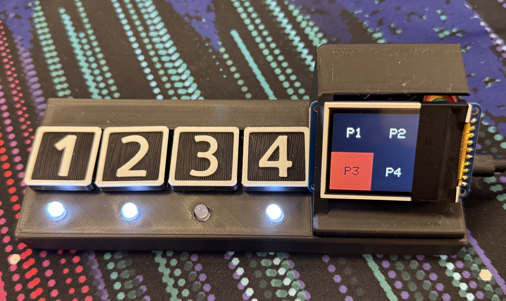

# Hack K-State - The Aparatus

The Aparatus is a hardware interface for *The Fateful Five*, a game developed by BALD-rs for Hack K-State 2024. Its main purpose is to provide an accessible, non-distracting, and easily understandable alternative for a traditional mouse and keyboard setup. The Repo for the game can be found at [https://github.com/BALD-rs/hack-kstate-game-js](https://github.com/BALD-rs/the-fateful-five.git)



The Aparatus consists of four easy-to-read buttons, four indicator LEDs, and a TFT display. The indicator LEDs show which buttons are available for use at any given time to help aid the player, and the display presents information relevant to the current state of the game.

## Technology
The Aparatus is built using the following technology:
- **Microcontroller**: Raspberry Pi Pico with RP2040, chosen for its flexibility and ease of use with C++.
- **Display**: Adafruit 1.8" TFT display, used to show game-relevant information and guide the player’s decisions.
- **Buttons and LEDs**: Four large, easy-to-read buttons for intuitive input, each paired with an LED to indicate availability and current state.
- **3D Printed Housing**: Designed in OnShape and printed using a Bambu Labs A1, creating a compact and ergonomic device tailored to gameplay.

## Installation
1. Clone this repository.
   ```bash
   git clone https://github.com/BALD-rs/Hack-K-State-2024-Hardware.git
   ```
2. Open the project in PlatformIO.
3. Connect the Raspberry Pi Pico to your computer via USB.
4. Upload the code to the Pico using PlatformIO.

## Usage
1. Connect *The Aparatus* to your computer and start *The Fateful Five*.
2. The indicator LEDs and TFT display will show relevant in-game information.
3. Use the buttons as indicated by the LEDs and display to participate in game actions like voting, navigating, and interacting with prompts.

## Commands
Communication between the game and *The Aparatus* is handled via serial using five-character commands. Each command consists of:
  - **1 Action Character**: Specifies the type of action the game is requesting.
  - **4 Data Characters**: Provides information about the current state of the game, such as player status.

Commands between the game and *The Aparatus* follow a structured five-character format:
- **Example Command**: `VYYNY`
  - `V`: Represents a voting session.
  - `Y` or `N`: Indicates each player's status (Y = active, N = inactive). In this example, player 3 has already been voted out (as shown in the image above).

This design enables clear, consistent communication with the game, and each command activates specific LEDs to display available options. A full breakdown of available commands can be found in the GameSerialManager library.

## Future Improvements
- **Larger Buttons**: Enhancing accessibility and ease of use for all players.
- **Expanded Display Functions**: Adding more information on the TFT display, such as timers or round-specific details, for even more comprehensive feedback.
- **Audio Feedback**: Adding a small speaker or buzzer to provide sound cues for game events.
- **Modularity for New Games**: Designing the hardware to support configuration for other games in the future, making *The Aparatus* a versatile tool for different types of interactive gameplay.

This project showcases a simple yet powerful setup to make *The Fateful Five* more engaging and accessible for all players.
